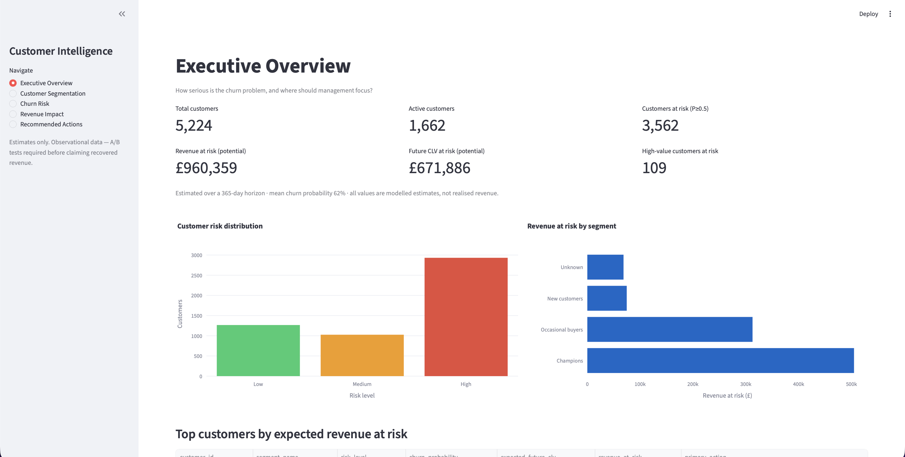

# Customer Lifetime Value & Churn Engine

An end-to-end decision-support platform that answers one executive question:

> **Which customers are likely to churn, how much future revenue is at risk, why are they likely to churn, and which customers should we prioritise for retention?**

This is an end-to-end analysis — temporal (leakage-safe) features,
calibrated churn probabilities, CLV, a revenue-at-risk engine, value-weighted
prioritisation, per-customer explanations, and a C-suite dashboard. The success
metric is **revenue protected**, not model accuracy.



---

## Goal

Companies usually answer churn with a blunt rule — *"anyone inactive for 90 days
is at risk"* — and a generic discount. That targeting spends money on the wrong
people and ignores customer value. This project replaces it with a value-aware,
explainable, temporally valid engine and quantifies the uplift over the rule.

The core insight: the highest-probability churner is rarely the best retention
investment. Prioritise by **expected revenue at risk = P(churn) × expected CLV**
(e.g. a £5,000 customer at 55% risk beats a £50 customer at 90%).

## Data

**UCI Online Retail II** — ~1.07M transaction rows (Dec 2009–Dec 2011), two
yearly sheets. Cleaned to **808,641 rows / 5,897 customers**. Customer ID is
missing on 22.8% of rows and is **MNAR** (anonymous vs identified), so those rows
are excluded from customer-level modelling and documented as a bias. No static
churn label is used; churn is constructed temporally.

## Method

**Temporal design (no leakage).** Features use only the observation window
(`≤ T`); churn = no purchase in the performance window `(T, T+90]`. Models are
trained on **multiple monthly cohorts** and split by **time** (earlier cohorts
train, later validate/test) — never randomly.

Pipeline stages (Kedro):

```
ingestion → feature-quality curation → feature store + labels
                                    → churn models (calibrated) ─┐
                                    → CLV model ─────────────────┤
                                                                 ▼
                                      revenue at risk → prioritisation
                                                                 ▼
                                explainability (SHAP) → recommendations → dashboard
```

- **Features:** ~50 leakage-safe RFM + behavioural features (recency, rolling
  30/90/180/365-day activity, purchase intervals + volatility, product
  diversity, return/cancellation rates, growth/momentum, trends).
- **Churn models:** Logistic Regression, Random Forest, LightGBM; best by
  validation PR-AUC, then **calibrated** on validation; MLflow-tracked.
- **CLV model:** supervised regression of next-90-day net revenue (Ridge / RF /
  LightGBM-Tweedie), extended to a 365-day horizon via a retention-geometric
  formula. Observed vs modelled value is explicitly separated.
- **Segmentation:** K-Means / GMM / hierarchical (best by silhouette) compared
  with an interpretable RFM rule-based segmentation.
- **Explainability:** SHAP for every scored customer (global, per-customer,
  per-segment).
- **Survival analysis:** Kaplan–Meier + Cox PH (exploratory).

## Results

**Churn model** (test cohort): ROC-AUC **0.809**, PR-AUC **0.816**, F1 **0.794**;
top 10% by probability captures **15.7% of all churners at 90% precision**
(1.57× lift). Selection is on validation (RF PR-AUC 0.908); test is reported only.

**CLV & revenue at risk** (test cohort, 5,224 customers, 365-day horizon):
LightGBM R² **0.70**; total expected CLV **£6.10M**; **total revenue at risk
£960,359** (modelled estimates, not realised revenue).

**Prioritisation** — revenue at risk captured at each budget:

| Strategy | Top 100 | Top 250 | Top 500 | Top 1,000 |
| -------- | ------- | ------- | ------- | --------- |
| Recency rule (naive) | £5,341 | £12,034 | £21,768 | £55,004 |
| Churn probability only | £1,233 | £3,206 | £14,983 | £54,295 |
| Expected CLV only | £73,331 | £123,511 | £215,822 | £382,750 |
| **Revenue at risk (recommended)** | **£138,473** | **£228,431** | **£336,884** | **£498,528** |

At a budget of 100, value-weighted prioritisation captures **24.9× more** revenue
at risk than the recency rule and **112× more** than ranking by churn probability
alone.

**Segments** (k=3, silhouette 0.30): Champions 1,870 · Occasional buyers 2,628 ·
New customers 443.

## Recommendations

The recommendation layer maps segment + dominant SHAP risk factor to actions,
ranked by potential CLV at risk:

| Action | Customers | Potential CLV at risk |
| ------ | --------- | --------------------- |
| Re-engagement campaign to rebuild purchase habit | 2,313 | £479,273 |
| Targeted offer to reactivate declining spend | 1,192 | £165,024 |
| Value-oriented offers and bundles | 684 | £106,923 |
| Reward loyalty; protect experience | 346 | £77,280 |
| Win-back outreach | 225 | £41,061 |

**Observational caveat:** the data cannot estimate treatment effects. These are
prioritised hypotheses; **A/B testing / causal experimentation is required** to
measure the actual effect of each intervention. No recovered revenue is claimed —
only *potential* / *estimated* figures.

## Tools

Python 3.12 · **Kedro** (orchestration) · **uv** (env) · scikit-learn · LightGBM ·
XGBoost · **SHAP** · **MLflow** · **Streamlit** + Plotly · lifelines · pandas /
NumPy · pytest / ruff.

## Project layout

```
conf/base/            # catalog + parameters (temporal design, model configs)
data/                 # medallion layers (gitignored): raw → curated → features → outputs
src/customer_clv_churn/
├── pipelines/
│   ├── data_ingestion/     # download → parse → clean → validate → summarise
│   ├── data_quality/       # feature-quality curation (flags, winsorise, grouping)
│   ├── feature_engineering/# customer feature store + churn labels
│   ├── baseline/           # naive 90-day recency rule + evaluation
│   ├── segmentation/       # clustering + rule-based comparison
│   ├── churn_modeling/     # multi-cohort models, calibration, survival
│   ├── clv/                # CLV regression + revenue at risk
│   ├── prioritisation/     # value-weighted ranking + strategy comparison
│   ├── explainability/     # SHAP global / customer / segment risk factors
│   └── recommendations/    # segment + risk factor → retention actions
├── dashboard/              # five-page C-suite Streamlit app
├── pipeline_registry.py
└── settings.py
tests/                # mirrors src/ (51 tests)
docs/images/          # dashboard screenshots
Makefile · pyproject.toml · uv.lock
```

## Dashboard

Five pages: Executive Overview, Customer Segmentation, Churn Risk (per-customer
SHAP), Revenue Impact (budget slider), Recommended Actions.

```bash
uv sync
uv run kedro run                                   # build all datasets
uv run streamlit run src/customer_clv_churn/dashboard/app.py
# or: make dashboard
```

## Quickstart

```bash
uv sync                 # create the environment
uv run kedro run        # full pipeline (downloads the raw dataset)
uv run pytest           # 51 tests
uv run ruff check src tests
```

## Limitations & future work

- Observational data: interventions require A/B tests before any causal claim.
- MNAR missing Customer ID biases customer-level statistics (documented).
- Revenue-model tail is under-predicted, so totals are conservative.
- Next: generalise the framework to a subscription business (IBM Telco) and add
  A/B-test design for the recommended interventions.

*MIT License.*
